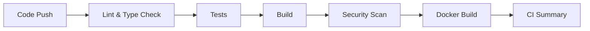
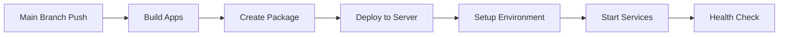
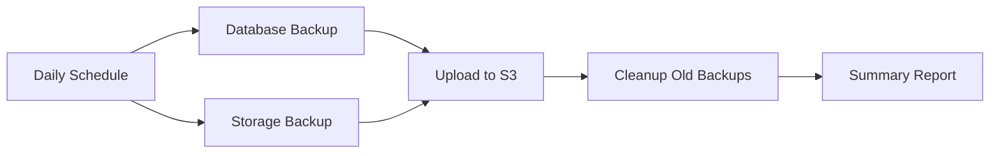

# GitHub Actions Workflows

This directory contains GitHub Actions workflows for CI/CD and backup automation.

## 📋 Workflows Overview

### 🔄 **CI Workflow** (`ci.yml`)
- **Trigger**: Push to `main`/`develop`, Pull Requests
- **Purpose**: Continuous Integration
- **Jobs**:
  - Lint & Type Check
  - Test (Vitest)
  - Build (Turbo)
  - Security Scan (Snyk)
  - Docker Build Test

### 🚀 **CD Workflow** (`cd.yml`)
- **Trigger**: Push to `main`, Manual dispatch
- **Purpose**: Continuous Deployment
- **Features**:
  - Auto-deploy to Ubuntu 22.04 via SSH
  - Docker containerization
  - Nginx reverse proxy setup
  - SSL certificate with Let's Encrypt
  - Health checks and monitoring

### 💾 **Backups Workflow** (`backups.yml`)
- **Trigger**: Daily at 2 AM UTC, Manual dispatch
- **Purpose**: Automated backups
- **Features**:
  - MariaDB database dump
  - MinIO storage mirror to S3
  - Automatic cleanup of old backups
  - Backup verification

## 🛠️ Setup Instructions

### 1. **Configure Secrets**
See [SECRETS.md](./SECRETS.md) for detailed instructions.

**Required Secrets:**
- `SSH_KEY` - Private SSH key for server access
- `SERVER_IP` - Ubuntu server IP address
- `DOMAIN` - Your domain name

### 2. **Server Preparation**
Ensure your Ubuntu 22.04 server has:
- Docker and Docker Compose installed
- Nginx installed
- Ports 22, 80, 443 open
- SSH access configured

### 3. **AWS S3 Setup** (for backups)
- Create S3 bucket for backups
- Configure IAM user with S3 permissions
- Add AWS credentials to GitHub Secrets

## 🔧 Workflow Details

### CI Pipeline


### CD Pipeline


### Backup Pipeline


## 📊 Monitoring

### Health Checks
- Web app: `https://yourdomain.com/health`
- Admin: `https://yourdomain.com/admin/health`
- API: `https://yourdomain.com/api/health`

### Logs
- Application logs: `/opt/tour-app/current/deployment/logs/`
- Nginx logs: `/var/log/nginx/`
- System logs: `journalctl -u tour-app.service`

### Backup Status
- Check S3 bucket for backup files
- Monitor backup workflow runs
- Verify backup integrity

## 🚨 Troubleshooting

### Common Issues

1. **Deployment Fails**
   - Check SSH connection
   - Verify server resources
   - Check Docker service status
   - Review application logs

2. **Backup Fails**
   - Verify AWS credentials
   - Check S3 bucket permissions
   - Ensure database connectivity
   - Check MinIO service status

3. **SSL Certificate Issues**
   - Verify domain DNS
   - Check port 80/443 access
   - Review Let's Encrypt logs
   - Check certificate expiration

### Debug Commands

```bash
# Check service status
sudo systemctl status tour-app.service

# View application logs
sudo docker-compose -f /opt/tour-app/current/deployment/docker-compose.dev.yml logs

# Test database connection
sudo docker-compose -f /opt/tour-app/current/deployment/docker-compose.dev.yml exec api pnpm db:status

# Check backup files
aws s3 ls s3://your-backup-bucket/database/
```

## 🔒 Security

### Best Practices
- Use strong, unique passwords
- Enable firewall rules
- Regular security updates
- Monitor access logs
- Use HTTPS everywhere
- Implement rate limiting

### Access Control
- SSH key-based authentication
- Database user permissions
- S3 bucket policies
- Nginx security headers
- Docker container isolation

## 📈 Performance

### Optimization
- Docker image caching
- Nginx gzip compression
- Static asset caching
- Database connection pooling
- Redis caching
- CDN integration

### Monitoring
- Resource usage monitoring
- Application performance metrics
- Database query optimization
- Network latency tracking
- Error rate monitoring

## 🔄 Maintenance

### Regular Tasks
- Update dependencies
- Security patches
- Backup verification
- Log rotation
- Certificate renewal
- Performance tuning

### Automated Tasks
- Daily backups
- Security scans
- Dependency updates
- Certificate renewal
- Log cleanup
- Health monitoring

---

For more information, see the individual workflow files and [SECRETS.md](./SECRETS.md).
